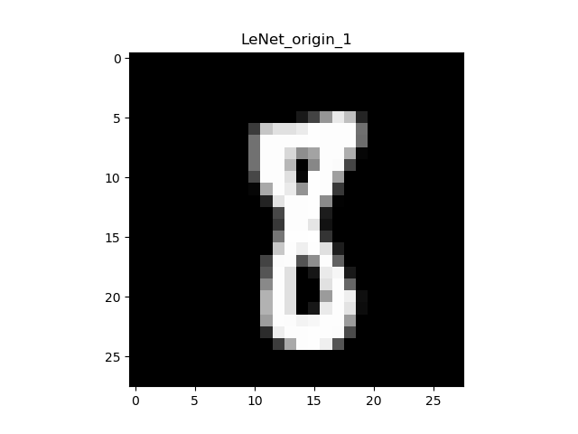
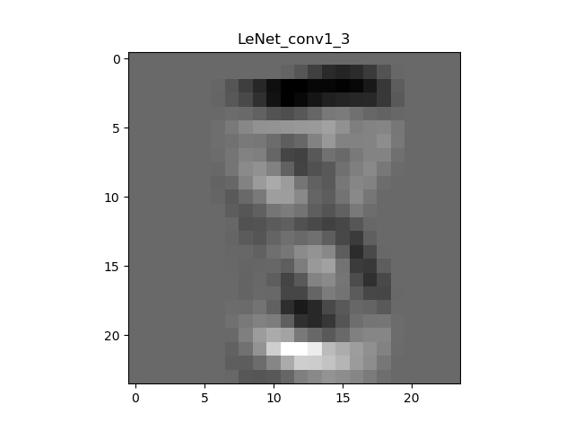
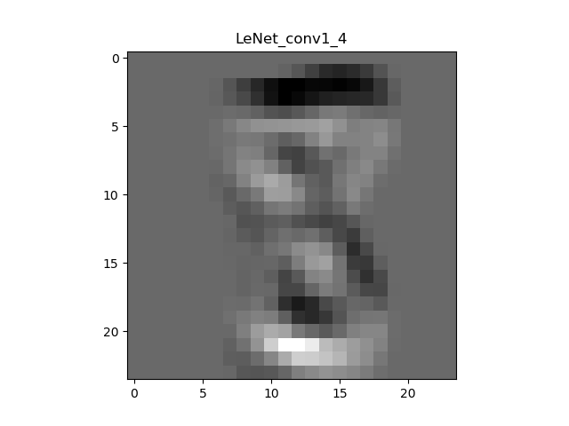
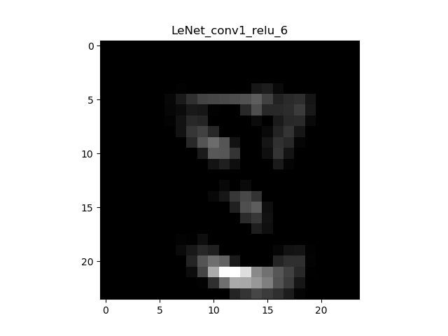
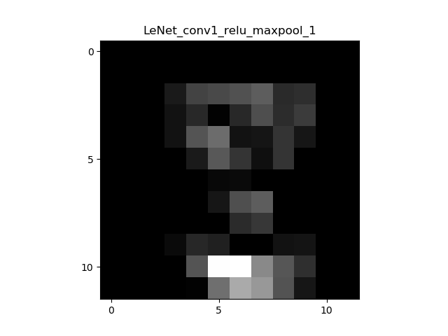

# pytorch-mnist


This program realize the recognization function of `MNIST` data. The original edition is [https://github.com/pytorch/examples/blob/master/mnist/main.py](https://github.com/pytorch/examples/blob/master/mnist/main.py).

In addtion to basic recognization function, i add some data visualization item including **training results visualization** and **feature map visualization**. 

# traning results
```cmd
python train.py --model LeNet
```

Enter the above script to start training.

I designed a few networks by myself which contain some of the advantages of classical neural networks such as: AlexNet, VggNet and so on. You can try others networks to see which works better. My conclusion is that the **deeper is better**. The `MyVggNet`, which gives the best results, is in imitation of VggNet.

```cmd
python train.py --model MyVggNet
```


| network | accuracy(%)|
|---|---|
|LeNet|98.91|
|MyFullConvNet|98.06|
|MyNetV1|99.19|
|MyNetV2|98.81|
|**`MyVggNet`**|99.27|

# feature map visualization

The feature map is generated during the test process of LeNet.

Check ./model/network/LeNet.py . I define a function show_graph() to show the feature map or save the feature map files.

You may remove the annotation in LeNet.py to get feature map.

## origin graph



The image above is the origin image of the MNIST dataset -num 8. Pixel size is `28 x 28`.

## conv1
<table>
    <tr>
        <td></td>
        <td></td>
        <td></td>
    </tr>
    <tr>
        <td></td>
        <td></td>
        <td></td>
    </tr>
</table>

After once convolution, we can still recognize the image as a number `8`. **Because of the output_channel number of the first convolution layer, there `6 feature maps`**.

## conv1_relu
<table>
    <tr>
        <td></td>
        <td></td>
        <td></td>
    </tr>
    <tr>
        <td></td>
        <td></td>
        <td></td>
    </tr>
</table>

The output of this layer is also 6 pieces, but not all of them are posted because of space. And you can see immediately what the ReLu activation function does. In layman's terms: make black areas darker and white areas the same. The expression of ReLu:

<div class="text" style=" text-align:center;">f(x) = max(0, x)</div>

Make Numbers less than 0 equal 0, and Numbers greater than 0 remain the same.In the training process, image data are all normalized, so that the pixel value range is -1 ~ +1.

## conv1_relu_maxpool
<table>
    <tr>
        <td></td>
        <td></td>
        <td></td>
    </tr>
    <tr>
        <td></td>
        <td></td>
        <td></td>
    </tr>
</table>

Obviously, after the image passes through the maximum pooling layer, the pixels are reduced by half, which is **what the pooling layer (sub-sampling) does: reduce the size of the image**.It can reduce the computational burden of the network and alleviate the problem of overfitting to some extent.But this is only up to a point, and the pooling layer may filter out many useful features.

It is worth noting that the pooling layer used in this program is the maximum pooling MAX_pooling, so it can be found that the brightness of the overall image becomes brighter compared with the feature map of the previous layer, because the maximum pooling is to reserve the value with the maximum value in the selected area.

******

The other feature maps are in the path "./model/lenet_feature_map". If you look at it closely you can understand what CNN is doing. Of course, if you're not a beginner you don't have to do this.
